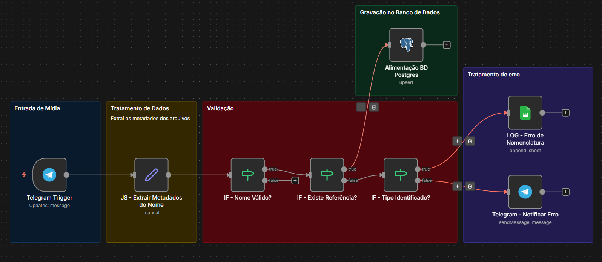
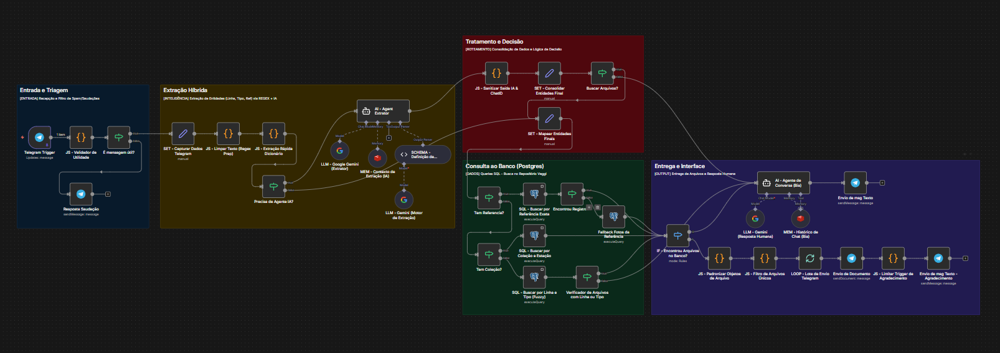
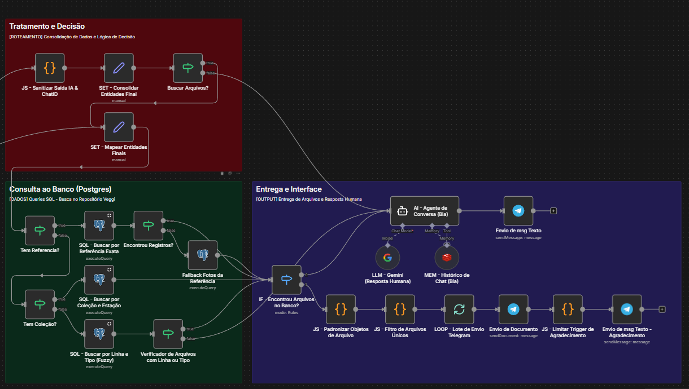
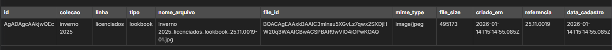

# 🤖 Drive Inteligente Veggi: Manual do Sistema

Este documento fornece uma imersão técnica exaustiva na arquitetura do sistema. Foi desenhado para garantir que qualquer administrador ou desenvolvedor compreenda o fluxo de dados desde o cadastro até a entrega via IA.

---

## 🏗️ 1. Arquitetura Lógica e Dados

O sistema opera sob o princípio de **Metadados Estruturados**. A inteligência do repositório começa no nome do arquivo, que atua como o "DNA" do registro no banco de dados.

### 🏷️ Protocolo de Nomenclatura (Separador `_`)
O sistema utiliza o separador **Underline (`_`)** para decompor os metadados. O código JavaScript realiza a contagem de blocos para decidir como indexar:

* **Padrão 4 Blocos (Com Referência):** `Coleção_Linha_Tipo_Referencia.ext`
    * *Ex: Inverno26_Casual_Video_10.20.3040.mp4*
* **Padrão 3 Blocos (Sem Referência):** `Coleção_Linha_Tipo.ext`
    * *Ex: Verao25_Noite_Catalogo.pdf*

> **Nota:** O campo Referência deve seguir rigorosamente o padrão `NN.NN.NNNN`. Caso o sistema detecte apenas 3 blocos, ele entende automaticamente que o arquivo é um ativo geral de linha e deixa o campo de referência vazio.

---

## 📥 2. Fluxo Auxiliar: Coletor de IDs

Este workflow é o responsável pelo **ETL (Extract, Transform, Load)** dos arquivos.

### 🛠️ Funções Detalhadas dos Nós:

1.  **Telegram Trigger:** Escuta o canal de repositório e isola o `file_id` (identificador persistente no servidor do Telegram) e o `file_name`.
2.  **Edit Fields (Script JS):** Executa a função `split('_')`.
    * **Lógica:** O código valida o comprimento do array. Se `length === 4`, ele isola o último bloco e aplica uma Regex para confirmar se o formato de pontos da referência está correto.
3.  **IF - Nome Válido?:** Atua como um firewall de dados. Se o nome não contiver underlines ou blocos insuficientes, o arquivo é rejeitado para evitar poluição no PostgreSQL.
4.  **Upsert Postgres:** Realiza a inserção inteligente. Se o `file_id` já existir, ele apenas atualiza os metadados (permitindo correções de nomes sem duplicar arquivos).

**Visualização do Fluxo de Coleta:**

### ⚠️ Sistema de Alertas e Auditoria (Logs)

O Drive Inteligente Veggi possui um mecanismo de **Autocorreção e Notificação**.

* **Validação em Tempo Real:** Sempre que um arquivo é enviado ao canal de repositório, o fluxo testa a integridade do nome.
* **Notificação de Falha:** Caso o padrão `_` seja ignorado, o nó `Telegram - Notificar Erro` dispara um alerta imediato ao administrador informando qual arquivo falhou e por quê.
* **Garantia de Dados:** Isso evita que arquivos fiquem "fantasmas" no Telegram sem estarem registrados no PostgreSQL.

---

## 🧠 3. Fluxo Principal: Agente do Drive Inteligente

O "Cérebro" do sistema que processa as solicitações dos usuários finais via linguagem natural.

### 🧩 Detalhamento dos Módulos:

#### A. Camada de Inteligência (NLU)
* **AI Agent Extrator (Gemini 1.5 Flash):** Este é o motor de processamento de linguagem natural. Através de um **Schema de Output (JSON)**, ele realiza a extração de entidades em duas frentes:
    * **Busca Direta:** Identifica códigos de referência no padrão `NN.NN.NNNN`.
    * **Busca Semântica:** Mapeia termos informais para os campos estruturados `colecao`, `linha` e `tipo`.
    * **Poder de Decisão:** Se o usuário diz "Manda o vídeo da 10.20.3040", a IA preenche o campo `referencia` e define o `tipo` como "video", permitindo que o SQL ignore filtros genéricos e vá direto ao arquivo exato.

* **Redis (Memória de Contexto):** Armazena o histórico por `chat_id`. Se o usuário perguntar "E tem a foto dela?" após ter recebido um vídeo da referência 10.20.3040, o Redis mantém essa referência "viva" para que a IA não precise perguntar de qual produto o usuário está falando.

#### B. Camada de Recuperação (SQL Dinâmico)

O **Nó PostgreSQL** é o motor de busca final. Ele utiliza uma lógica de **Filtros Dinâmicos Coerentes** para garantir resultados precisos.

* **Busca por Referência (Prioridade 1):** O sistema primeiro tenta filtrar pela `referencia` exata. Se preenchido, o SQL ignora outros filtros para garantir precisão cirúrgica.
* **Lógica Híbrida de Tipos (Mapeamento de Mídia):** Traduz termos genéricos em categorias técnicas:
    * **"Foto":** Busca por `still`, `lookbook` ou `conceito`.
    * **"Vídeo":** Filtra por termos que contenham formatos de vídeo ou a palavra "video".
* **Filtros Cruzados (Coleção + Linha):** Caso a referência seja omitida, o SQL cruza `colecao` e `linha` usando `ILIKE` com coringas (`%`).
* **Tratamento de Nulos:** Garante que arquivos sem referência (3 blocos) apareçam em buscas gerais de linha ou coleção.

---

## 📸 Arquitetura Visual dos Fluxos (n8n)

### 1. Visão Geral do Fluxo Principal

*Arquitetura de ponta a ponta: Entrada, Triagem, Inteligência e Entrega.*

### 2. Detalhe: Camada de Inteligência e Extração

*Uso do Google Gemini e Structured Output Parser para garantir dados limpos.*

### 3. Detalhe: Motor de Busca e Filtros

*Lógica de busca avançada no PostgreSQL com suporte a múltiplos critérios.*

### 4. Fluxo Auxiliar: Coletor de IDs

*Automação de back-office para alimentação rápida do banco de dados.*

### 5. Diagrama da Estrutura da Tabela

---

## 🔧 4. Gestão de Erros e Manutenção

### 🛠️ Ajuste de IA e Sinônimos
Se o sistema falhar ao identificar um termo (ex: usuário diz "peça" em vez de "linha"), a manutenção deve ocorrer no nó **SCHEMA - Definição de Campos**, adicionando sinônimos ao prompt.

### 📋 Tabela de Troubleshooting

| Sintoma | Causa Provável | Solução |
| :--- | :--- | :--- |
| **IA ignora a referência** | Input fora do padrão `NN.NN.NNNN` | Ajustar o Regex de limpeza ou treinar o prompt. |
| **Busca retorna "Vazio"** | Divergência no cadastro (falta de `_`) | Re-enviar o arquivo com a nomenclatura correta. |
| **Respostas desconexas** | Memória do Redis corrompida | Limpar o histórico de chat ou aguardar expiração. |

---

## 🛠️ Especificações Técnicas

| Módulo | Tecnologia | Descrição |
| :--- | :--- | :--- |
| **Orquestrador** | n8n | Coordenação de todos os nós e Webhooks. |
| **IA / LLM** | Google Gemini | Processamento de linguagem natural e extração. |
| **Banco de Dados** | PostgreSQL | Armazenamento de metadados e File IDs. |
| **Memória** | Redis | Histórico de chat e persistência de contexto. |

---

## 📥 Downloads de Engenharia

| Componente | Tipo | Link |
| :--- | :--- | :--- |
| **Workflow Principal** | JSON (n8n) | [Baixar](./workflows/drive-inteligente-assistente-principal.json) |
| **Workflow Coletor** | JSON (n8n) | [Baixar](./workflows/coletor-de-ids.json) |
| **Setup de Banco** | SQL Script | [Ver Script](./sql/setup_database.sql) |

> **Nota:** Para importar no n8n, basta baixar o arquivo JSON e arrastar para o editor.

---

*Documentação produzida para o projeto Drive Inteligente Veggi. 2026.*

---

[Voltar para o código no GitHub](https://github.com/nathvegi/drive-inteligente-veggi-n8n)
